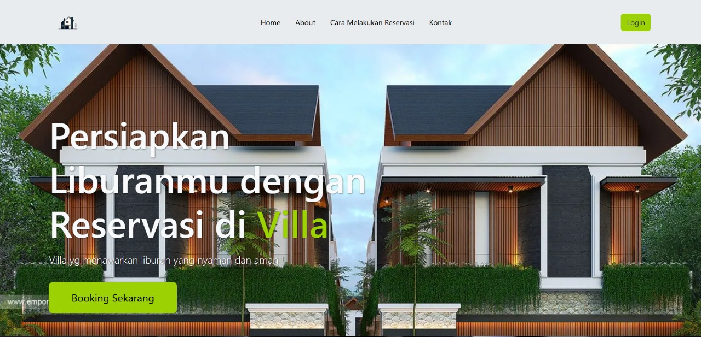
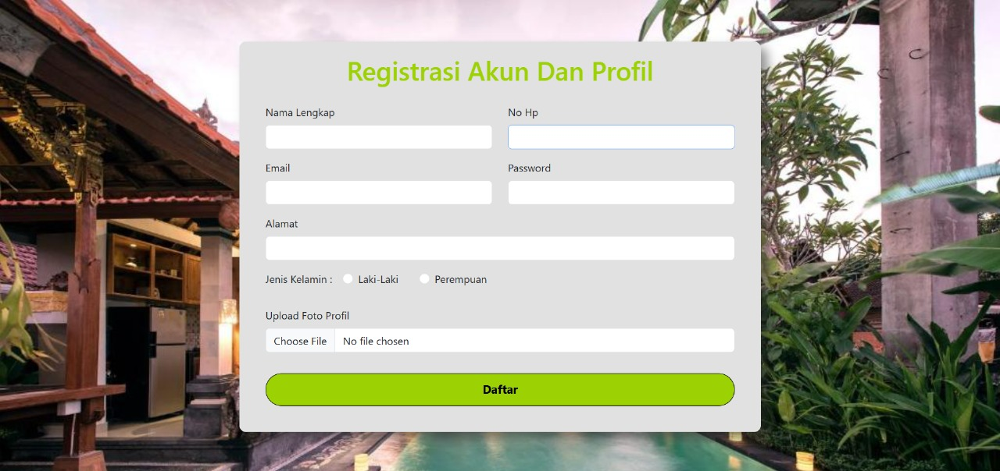
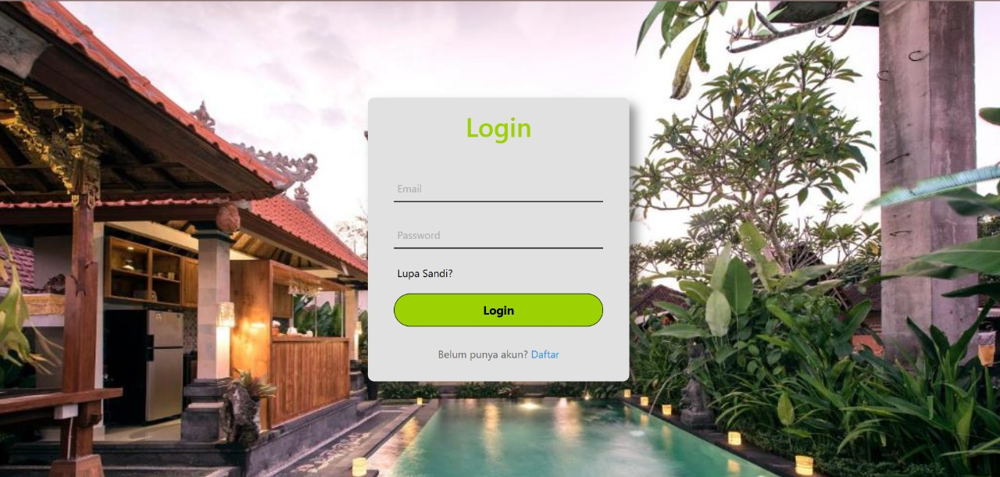

# 🏡 Web Reservasi Villa

Website sederhana untuk Reservasi/booking Villa, dibuat sebagai proyek kelompok dengan pengujian aplikasi menggunakan metode **Black Box**, **White Box**, dan **Grey Box**.

---

## 👨‍💻 Tim Pengembang

- **Frontend Developer & GitHub**: Dede Ardiansah
- **Tester**:
  - Devan Zulfangga
  - Muhamad Nabil Arrafi
  - Sammun Hakeki Muchlis

---

## ✨ Fitur

- Register & Login
- Halaman home 
- Halaman villa
- Halaman pembayaran villa & metode pembayaran
- Validasi input form

---

##  Pengujian

###  Black Box Testing  
**Dilakukan oleh**: Devan Zulfangga

**Contoh skenario uji**:
- Input kosong pada form register
- Email tidak valid saat login
- Password tidak cocok saat register

---

###  White Box Testing  
**Dilakukan oleh**: Sammun Hakeki Muchlis

**Cakupan**:
- Desk Checking
- Code Walkthrough
- Formal Inspection
- Control Flow Testing
- Data Flow Testing
- Basic Path Testing
- Loop Testing

---

###  Grey Box Testing  
**Dilakukan oleh**: Muhamad Nabil Arrafi

***Metode***:
- Manipulasi data pengguna dan ID pemesanan
- Pengubahan metode pembayaran secara langsung dari UI
- Validasi DOM setelah melakukan booking
- Interaksi dengan `localStorage` (cart, villas, paymentOptions)

---

###  Cara Menjalankan 
Buka `index.html` di browser

---

###  Tampilan Aplikasi
---

## Halaman Utam

## Halaman Register

## Halaman Login

