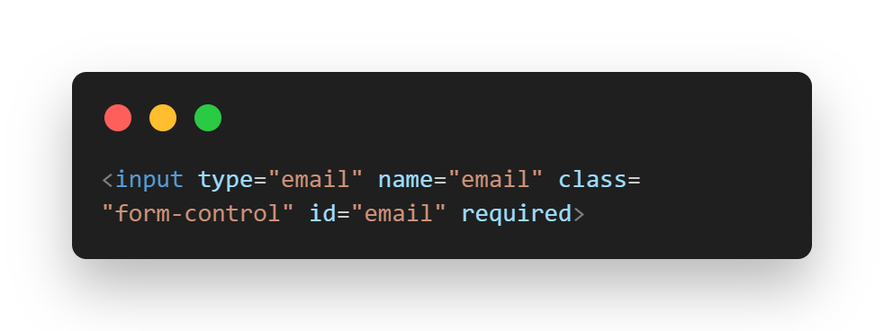
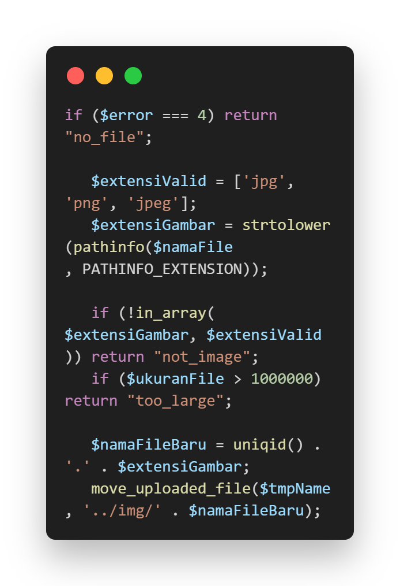

# Gray Box Testing

1.🔧 Orthogolanal Array Testing

Tujuan: Menguji kombinasi input secara sistematis agar semua kombinasi penting diuji tanpa pengujian yang berlebihan.

| No | Email   | Password | Tanggal Booking | File Upload  | Hasil                       |
| -- | ------- | -------- | --------------- | ------------ | --------------------------- |
| 1  | Valid   | Valid    | Valid           | Valid (.jpg) | Booking Sukses              |
| 2  | Kosong  | Valid    | Valid           | Valid (.jpg) | Error: Email wajib diisi    |
| 3  | Valid   | Kosong   | Valid           | Valid (.jpg) | Error: Password wajib diisi |
| 4  | Valid   | Kosong   | Valid           | Valid (.jpg) | Error: Password wajib diisi |
| 5  | Valid   | Kosong   | Valid           | Valid (.exe) | Error: File ditolak         |
| 6  | Invalid | Kosong   | Valid           | Valid (.jpg) | Error: Format email salah   |

2. 🔄 Matrix Testing: integraasi antar modul

Tujuan: Menguji integrasi antar modul, apakah data antar modul saling terhubung dengan baik.

| **No** | **Modul**  | **Terkoneksi Ke** | **Status** |
| ------ | ---------- | ----------------- | ---------- |
| 1      | Register   | Login             | ok ✅      |
| 2      | Login      | Booking           | ok ✅       |
| 3      | Booking    | Pembayaran        | ok ✅         |
| 4      | Pembayaran | Riwayat Booking   | ok ✅         |
| 5      | Admin      | Manajemen Data    | OK ✅         |

  
3. 🔁 Regression Testing

Tujuan: Menguji bahwa fitur lama tetap berjalan normal setelah adanya penambahan/modifikasi fitur baru.

| **No** | **Perubahan**                        | **Dampak Diuji**     | **Status** | **Gambar** |
| ------ | ------------------------------------ | ------------------------------------ | -------------------- | ---------- |
| 1      | Penambahan validasi email            | Registrasi           | OK✅         |
| 2      | Perbaikan session timeout            | Login & Dashboard    | OK ✅        |
| 3      | Penambahan pengecekan tanggal lampau | Booking              | OK ✅        |
| 4      | Penambahan validasi file upload      | Booking & Pembayaran | OK ✅        |

4. 🧩 Pattern Testing – Identifikasi Pola Kesalahan Umum

Tujuan: Mengidentifikasi pola-pola kesalahan yang sering terjadi selama pengujian.

| **No** | **Pola Error**           | **Contoh**          | **Penanganan**            |
| ------ | ------------------------ | ------------------- | ------------------------- |
| 1      | Email tidak valid        | `"userexample.com"` | Validasi muncul           |
| 2      | Password salah           | `"wrongpass"`       | Error login               |
| 3      | Tanggal lampau           | `"01-01-2023"`      | Error tanggal tidak valid |
| 4      | File upload bukan gambar | `".exe"`            | File ditolak              |
| 5      | SQL Injection            | `"' OR 1=1 --"`     | Input diblok, log direkam |

